# ENP RE - Electrical Network Parameters Calculation Software


## Overview
**ENP RE** is a Windows-based software designed for analyzing and calculating electrical network parameters. It offers tools for generating admittance and impedance matrices, as well as running power flow simulations using Gauss-Seidel, Newton-Raphson, and Fast Decoupled Load Flow (FDLF) methods. This software is aimed at students, engineers, and professionals working with electrical power systems, providing both numerical solutions and an easy-to-use interface.

For a detailed presentation of the software and its underlying concepts, please refer to the [ENP RE.pdf](ENP%20RE.pdf) in this repository.

## Features
- **Admittance and Impedance Matrix Calculation:**
  - Calculates the Y-bus (admittance) and Z-bus (impedance) matrices for electrical grids.
- **Power Flow Simulation:**
  - Simulates the power flow in the network using:
    - Gauss-Seidel
    - Newton-Raphson
    - Fast Decoupled Load Flow (FDLF)
- **Graphical User Interface (GUI):**
  - Provides an easy-to-navigate interface with visualizations of the input data, matrix generation, and simulation results.
- **Data Input/Output:**
  - Users can input system data for calculations and save the output results.

## Theoretical Background

### Introduction to Electrical Networks
An electrical network is a set of infrastructures that allow the transmission of electrical energy from production centers to consumers. It consists of power lines at different voltage levels, connected in electrical substations equipped with transformers to change voltage levels and distribute electricity. Dynamic management of the network is essential to ensure stability between production, transmission, and consumption.

### Electrical Network Parameters

#### Admittance Matrix
The admittance matrix (Y-bus) represents the topology of an electrical network and contains all the information about the network. It can be described in matrix form and is essential for network analysis.

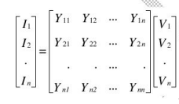

#### Impedance Matrix
The impedance matrix (Z-bus) is a matrix representation of the impedances between different nodes (or buses) in the network. Each element Zij represents the impedance between node i and node j. This matrix is crucial for analyzing network behavior, particularly for calculating short-circuit currents, load distributions, and conducting stability and network protection studies.

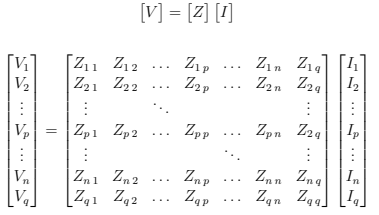

### Power Flow Analysis
Power flow studies are essential for planning the construction and expansion of electrical networks, as well as for their operation and control. ENP RE implements three common numerical methods for power flow analysis:

1. **Gauss-Seidel (GS) Method**
2. **Newton-Raphson (NR) Method**
3. **Fast Decoupled Load Flow (FDLF) Method**

These methods allow users to obtain solutions for network quantities in normal, balanced operation under steady-state conditions, including node voltages, injected powers at nodes, and power flowing through lines.


## Installation Guide

### System Requirements:
- **Operating System:** Windows 7 or later

### Installation Steps:
1. Download the `ENP RE Setup v2.0.exe` file from the [releases page]([https://github.com/Souhaib-Cherbal/ENP-RE/releases](https://drive.google.com/drive/folders/1jcPT89-rEU1JJHBo188s34OgdVBhcjdp?usp=sharing)).
2. Run the installer and follow the on-screen instructions.
3. Once installed, launch ENP RE from your desktop or start menu.

### Installation Process
The installation process is straightforward:

1. Welcome page:
   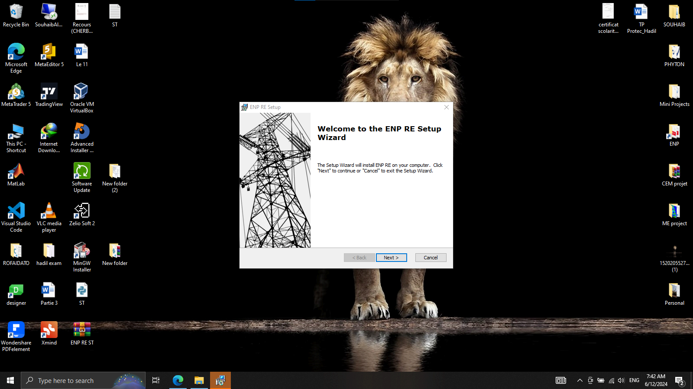

2. Enter the serial number:
   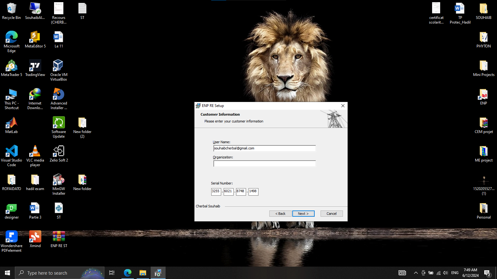

3. Choose installation location:
   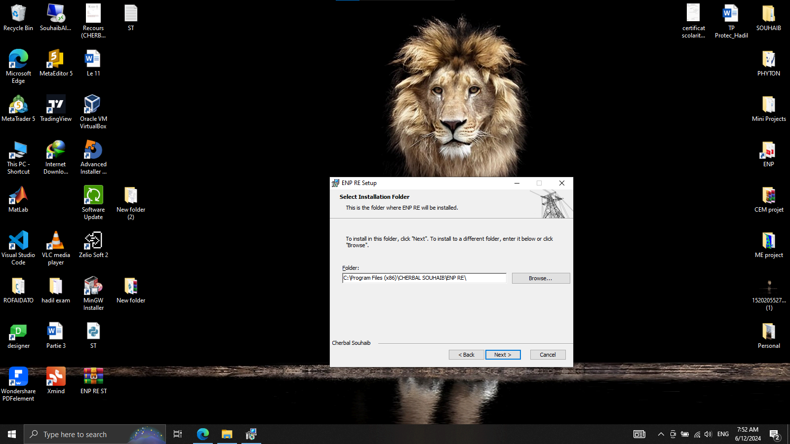

4. Installation in progress:
   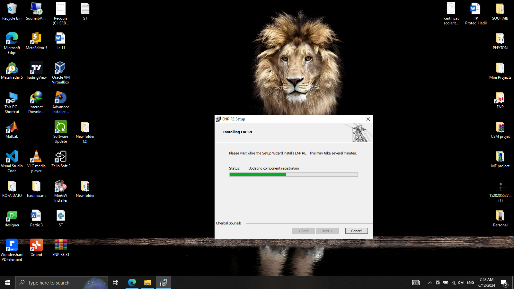

### License Key
When prompted, use the following license key to activate the software:
```
3255-6021-8748-1498
```

## Usage Instructions

1. **Launching the Software:**
   Run ENP RE from your desktop or start menu. Enter the provided license key when prompted.

2. **Navigating the Interface:**
   - **Main Page:** Choose the type of network and input the relevant system data.
     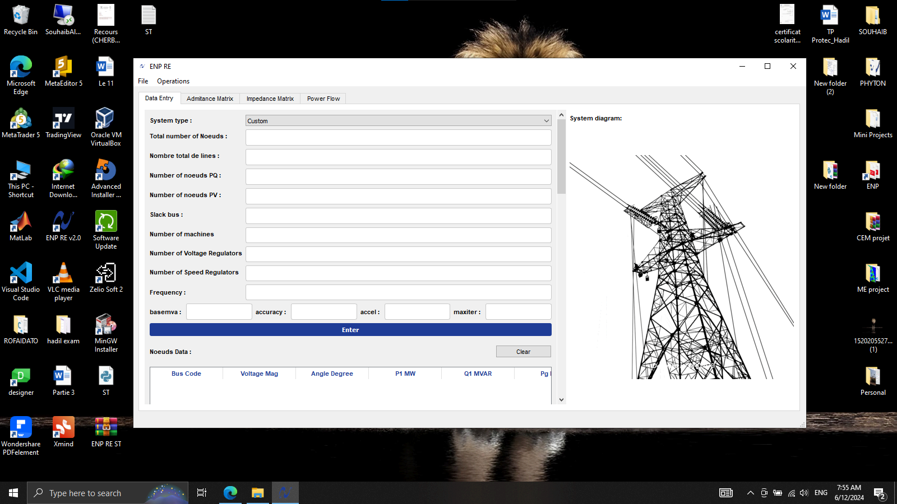

   - **System Selection:** Choose the system you want to analyze.
     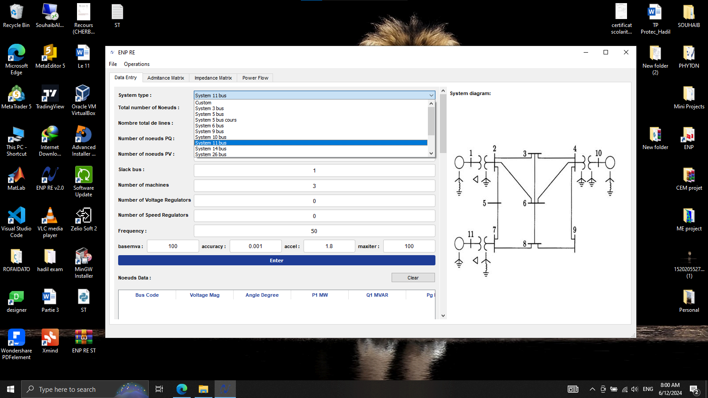

   - **Data Loading:** Load the system data for analysis.
     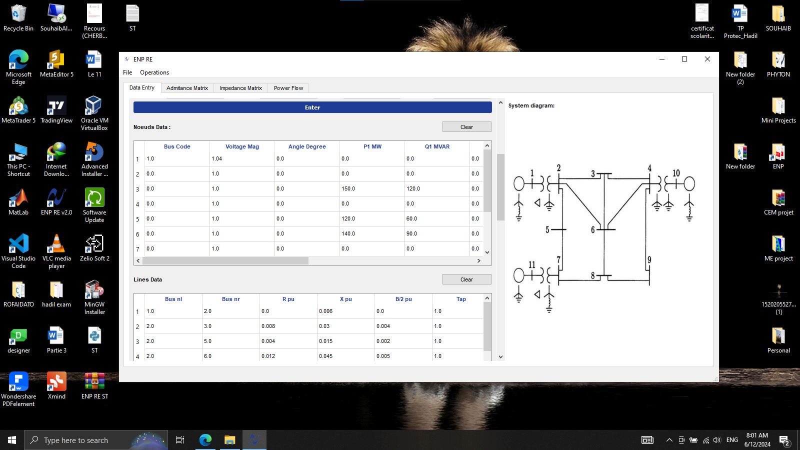

   - **Admittance Matrix:** Calculate and view the Y-bus matrix.
     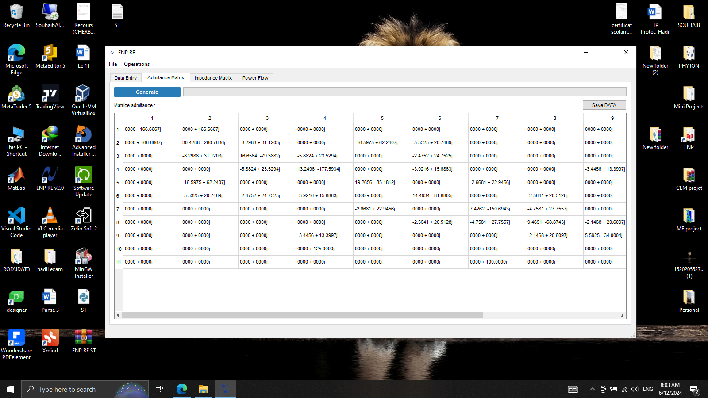

   - **Impedance Matrix:** Calculate and view the Z-bus matrix.
     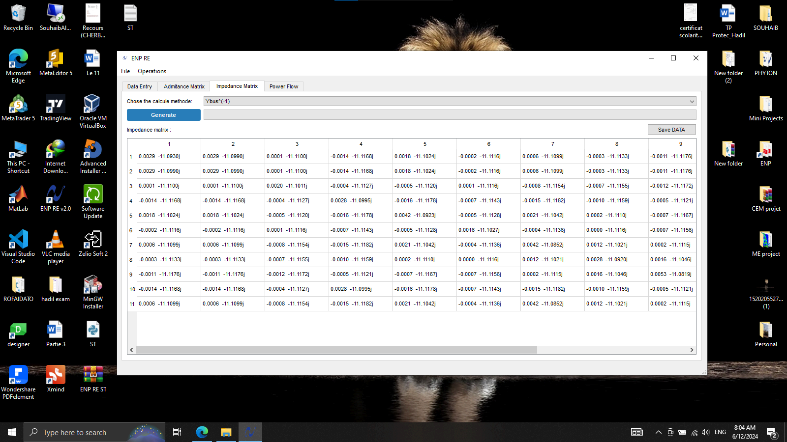

   - **Power Flow Simulation:** Choose one of the methods:
     - Gauss-Seidel
       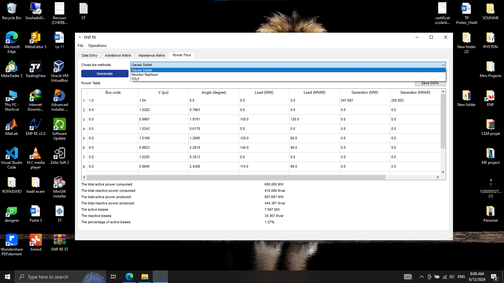
     - Newton-Raphson
       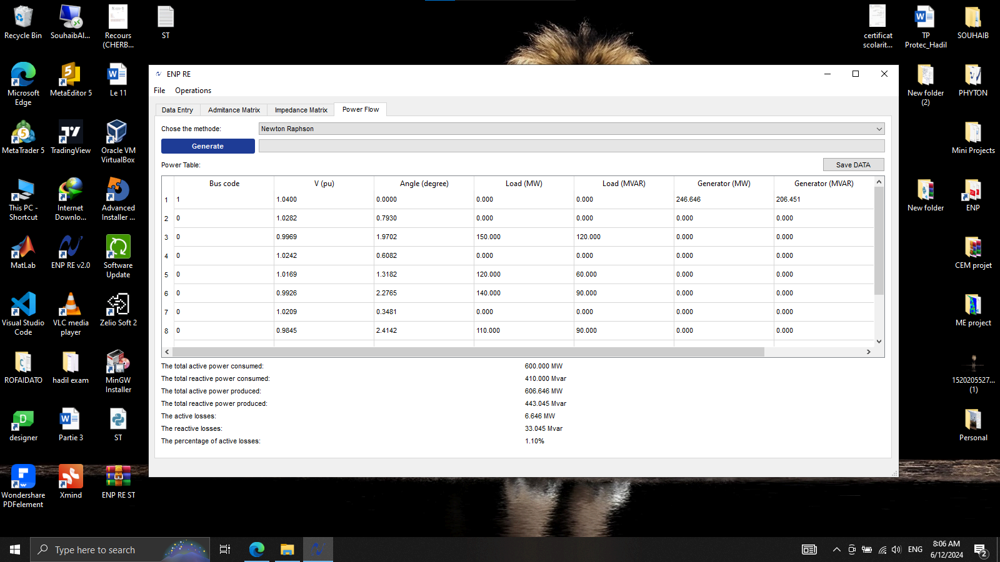
     - Fast Decoupled Load Flow (FDLF)
       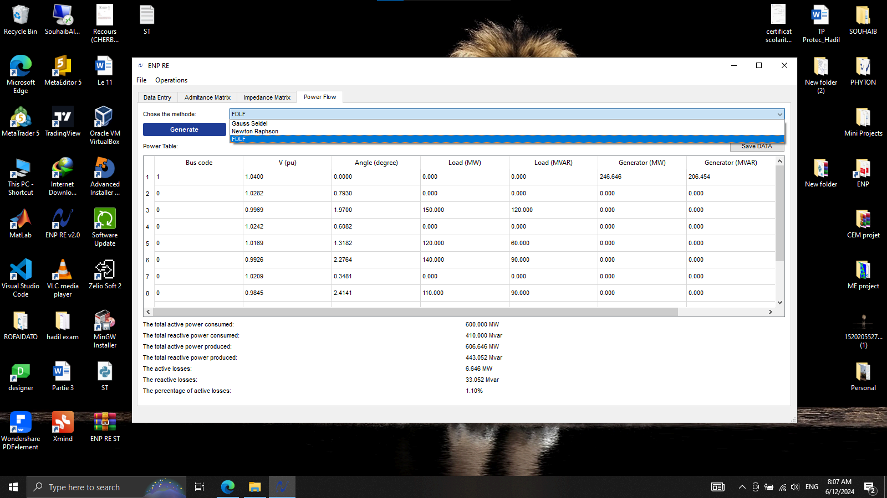

   - **Saving Results:** Save the simulation results for further analysis.
     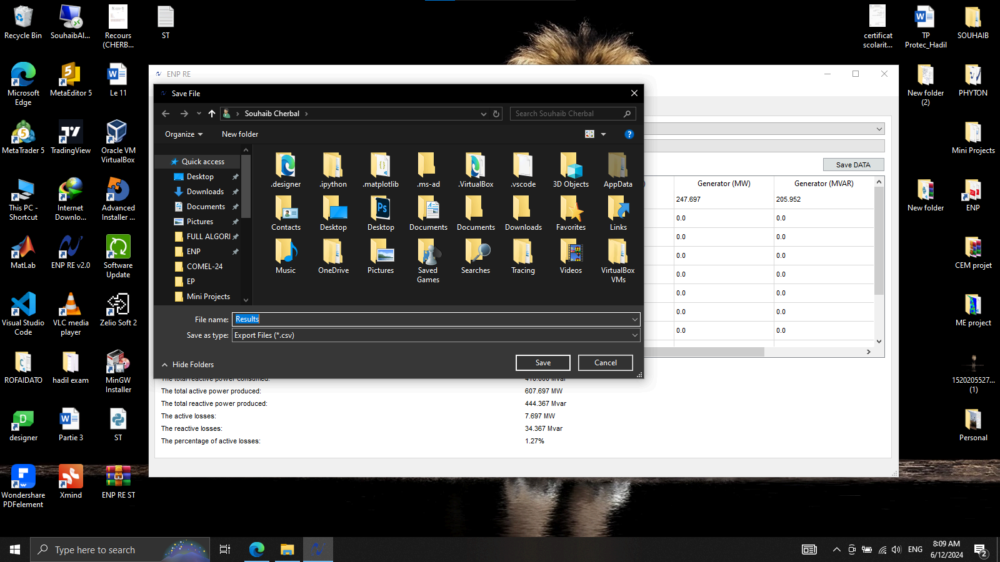

## Contributions
Contributions to improve **ENP RE** are welcome! Here's how you can contribute:
1. Fork the repository.
2. Create a feature branch (`git checkout -b feature-branch`).
3. Commit your changes (`git commit -m 'Add new feature'`).
4. Push to the branch (`git push origin feature-branch`).
5. Open a pull request.

## License
This project is licensed under the MIT License - see the [LICENSE](LICENSE.txt) file for details.

## Contact
For any questions or support, feel free to:
- Open an issue on GitHub
- Email: souhaibcherbal@gmail.com
- LinkedIn: [Souhaib Cherbal](https://www.linkedin.com/in/souhaib-cherbal/)


